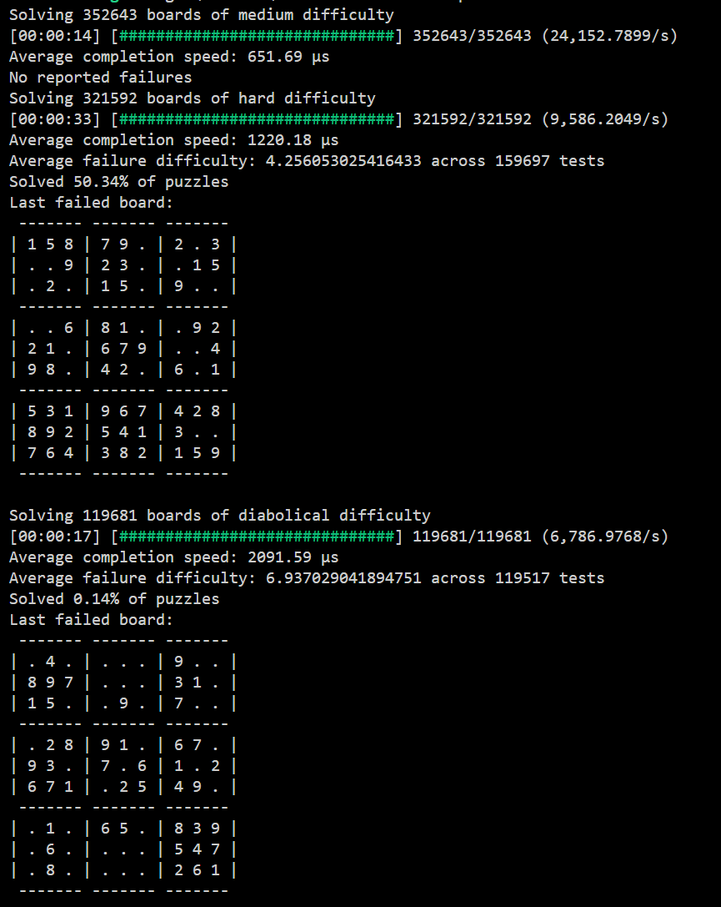

I decided to build a logic-based Sudoku solver as practice for both algorithmic thinking and to become more familiar with Rust. I wanted to avoid the brute-force approach to focus on the more interesting logical aspects to the game and to see what I could build into code.

There are a number of heuristics used in Sudoku that I have implemented, and plan to implement to build a more capable solver.

In its current state, it can solve some moderately high difficulty puzzles for a human:

  

I built a performance tester using Rayon to evaluate performance on a huge dataset from [The Sudoku Exchange Puzzle Bank](https://github.com/grantm/sudoku-exchange-puzzle-bank)

  

I have also built a TUI input parser using Crossterm and Ratatui:

  

